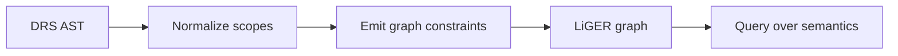

# DRS To LiGER Plan

## Reference Pipelines

## What The Stanza Service Shows

- Input is converted into a flat list of constraints.
- Each constraint is essentially a mother node, a relation label, and either a daughter node or a value.
- The graph is serialised as a list of `graphElements`.
- The same general idea should work for DRS: AST nodes become graph nodes, relations become constraints.

## Required DRS Properties

- Every DRS must have a root that LiGER can anchor queries to.
- Existing state labels should be preserved when present.
- DRSs without an explicit state label still need an internal root node.
- Nested DRSs in complex conditions must get their own root nodes.
- Scoped conditions, implications, negation, presupposition, and merge need a stable graph representation.
- Discourse referents must be addressable consistently across the graph.
- Canonical names should be generated before graph emission, not during querying.
- The graph should remain queryable even when the original surface form had no state labels.

## Open Shape Decisions

- Whether each DRS root is a dedicated node or encoded as an attribute on an existing node.
- Whether merge is represented as an edge, a relation node, or a structural grouping node.
- How to represent nested scope bodies so LiGER can query dominance reliably.
- Whether anaphora and presupposition mappings should be separate subgraphs or ordinary relations.
- Whether state labels are only metadata or actual queryable nodes.

## Working Assumption

- Use DRS state labels as the semantic anchor when they exist.
- Introduce an implicit root identifier when they do not.
- Compile the AST into LiGER-style constraints only after canonical referent allocation and merge resolution decisions are fixed.
